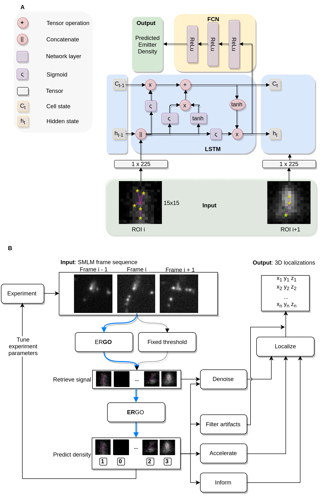
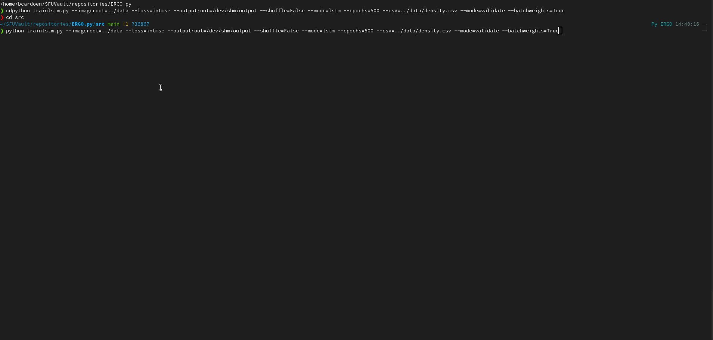

# ERGO: Efficient Recurrent Graph Optimized Emitter Density Estimation in Single Molecule Localization Microscopy

This repository holds the source accompanying our [IEEE Transactions in Medical Imaging 2020 paper](http://www.cs.sfu.ca/~hamarneh/ecopy/tmi2020.pdf).

### Repository organization

[ERGO](https://github.com/bencardoen/ERGO) has 2 stages:
  - Localization ER**GO** : [ERGO.jl](https://github.com/bencardoen/ERGO.py)
  - Counting/Density estimation **ER**GO : [ERGO.py](https://github.com/bencardoen/ERGO.py)

This repository holds the Python code for the emitter density prediciton stage (ER).

All files in this repository are licensed under **Affero GPL v 3**, copyright 2018-2021 Ben Cardoen.
The software was developed in a multidisciplinary collaboration between the labs of Prof. Ghassan Hamarneh, Prof. Ivan Robert Nabi, and Prof. Keng C. Chou.



We refer to the manuscript for a detailed explanation of architecture choices, losses, configuration, and so on.
Summarized, we leverage the information present in the stream of ROIs from at most 4 consecutive frames to more accurately predict density. Given that the frame sequence is highly variable, but only strongly correlates across a few consecutive frames, we enable specialization without overfitting.
The emission density per ROI (and frame) follows a Poisson distribution, learning such a counting process is non-trivial. To ensure we capture also the rare (high density) events we weight our loss accordingly.
The manuscript details this in detail.

### Layout
- **output**
  - **net** : saved network(s)
  - example results on training data are also included as figures
    - see src/plotter.py for plotted output
- **src** : python code + SLURM submissions scripts
  - trainlstm.py
- **data** : optional training data (images + csv with density GT), you can generate this using the ERGO.jl package, or use the data provided for your convenience.
  - training.tgz, which when extracted should offer:
    - frame_x_y.tif
      - ROI nr y from frame x
    - density.csv
      - framenr	roinr	mx my	count : mx/my are anchor locations in frame of ROI, count is GT of nr emissions in this ROI
  - see https://github.com/bencardoen/ERGO.jl on how to create similar training data from different sources


### Installation - Dependencies
- venv: see requirements_cedar.txt (compatible with Compute Canada) or requirements_local.txt
- [conda](https://docs.conda.io/en/latest/miniconda.html) : see environment.yml (change the location directory)

For example, using conda you would do:
```bash
conda env create --name ERGO --file=environment.yml
conda activate ERGO
```

### Usage
This project was trained on [SLURM](https://slurm.schedmd.com/overview.html) (HPC) based systems (e.g. Compute Canada), but ran equally well on my laptop (with 4G GPU).
An example submission script is added in ./src, but you can run the code also in a standard command line.

Please see src/submit.sh for an example on how to run the training/evaluation code. The arguments are documented in trainlstm.py

First, we extract data. Assume we start from repository directory.
```bash
cd data
tar -xf training.tgz
```

Then
```python3
conda activate ERGO
cd src
python trainlstm.py --imageroot=../data --loss=intmse --outputroot=/dev/shm/output --shuffle=False --mode=lstm --epochs=500 --csv=../data/density.csv --mode=validate --batchweights=True
```
This would look something like the below



The trainlstm.py script can do both training or evaluation only (using a saved network).

A summary listing of the parameters: (defaults are set in trainlstm.py line 33)
- imageroot: directory with ROIs in tiff format
- outputroot : where to save produced data
- shuffle : randomize input (not a great idea for LSTM)
- mode : LSTM, of FCN (e.g. ignore temporal data)
- epochs : self explanatory
- csv : where to find GT CSV data
- batch : batchsize (64)
- loss : which loss function to use
- pix : pixel size of 1`ROI
- logdir : where to write the full log file
- mode : train/test/validate/evaluate
- initstrategy : zero/random, for the weights
- seed : default 1
- lr : learning rate. Note that we use an oscillating LR
- trimclasses : if ROI x has k emitters, and trimclasses is k-2, bin all densities > k-2 into k-2. Useful for extreme long tail data. Not needed usually
- batchweights : off, compute weights (frequency) per batch to adapt to highly variable Poisson like data (recommended, but slow)
- pretraineddir : where to find saved network, only used if mode = evaluate. For examples, see ./output/net/save_me/*.pth

### FAQ
- I want to use this for my own data, how do I do this ?
  - Check https://github.com/bencardoen/ERGO.jl/blob/main/README.md on how to generate data in the format ER expects, an example notebook is provided.


### If you use this code, please cite
```bibtex
@article{cardoen2019ergo,
  title={Ergo: efficient recurrent graph optimized emitter density estimation in single molecule localization microscopy},
  author={Cardoen, Ben and Yedder, Hanene Ben and Sharma, Anmol and Chou, Keng C and Nabi, Ivan Robert and Hamarneh, Ghassan},
  journal={IEEE transactions on medical imaging},
  volume={39},
  number={6},
  pages={1942--1956},
  year={2019},
  publisher={IEEE}
}

```
